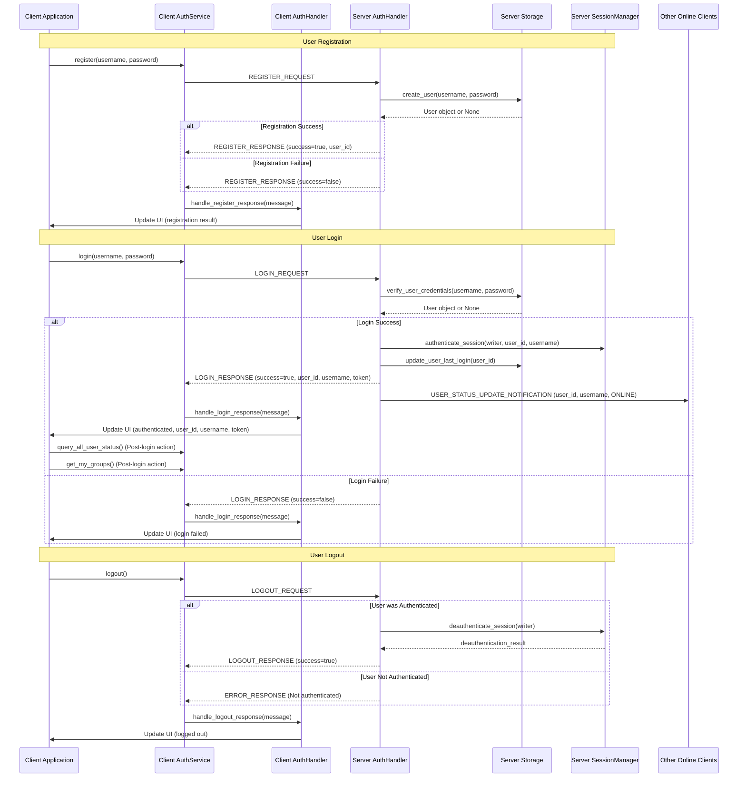

```mermaid
sequenceDiagram
    participant ClientApp as Client Application
    participant ClientService as Client AuthService
    participant ClientHandler as Client AuthHandler
    participant ServerHandler as Server AuthHandler
    participant ServerStorage as Server Storage
    participant ServerSession as Server SessionManager
    participant OtherClients as Other Online Clients

    Note over ClientApp, ServerSession: User Registration
    ClientApp->>ClientService: register(username, password)
    ClientService->>ServerHandler: REGISTER_REQUEST
    ServerHandler->>ServerStorage: create_user(username, password)
    ServerStorage-->>ServerHandler: User object or None
    alt Registration Success
        ServerHandler-->>ClientService: REGISTER_RESPONSE (success=true, user_id)
    else Registration Failure
        ServerHandler-->>ClientService: REGISTER_RESPONSE (success=false)
    end
    ClientService->>ClientHandler: handle_register_response(message)
    ClientHandler->>ClientApp: Update UI (registration result)

    Note over ClientApp, ServerSession: User Login
    ClientApp->>ClientService: login(username, password)
    ClientService->>ServerHandler: LOGIN_REQUEST
    ServerHandler->>ServerStorage: verify_user_credentials(username, password)
    ServerStorage-->>ServerHandler: User object or None
    alt Login Success
        ServerHandler->>ServerSession: authenticate_session(writer, user_id, username)
        ServerHandler->>ServerStorage: update_user_last_login(user_id)
        ServerHandler-->>ClientService: LOGIN_RESPONSE (success=true, user_id, username, token)
        ServerHandler->>OtherClients: USER_STATUS_UPDATE_NOTIFICATION (user_id, username, ONLINE)
        ClientService->>ClientHandler: handle_login_response(message)
        ClientHandler->>ClientApp: Update UI (authenticated, user_id, username, token)
        ClientApp->>ClientService: query_all_user_status() (Post-login action)
        ClientApp->>ClientService: get_my_groups() (Post-login action)
    else Login Failure
        ServerHandler-->>ClientService: LOGIN_RESPONSE (success=false)
        ClientService->>ClientHandler: handle_login_response(message)
        ClientHandler->>ClientApp: Update UI (login failed)
    end

    Note over ClientApp, ServerSession: User Logout
    ClientApp->>ClientService: logout()
    ClientService->>ServerHandler: LOGOUT_REQUEST
    alt User was Authenticated
        ServerHandler->>ServerSession: deauthenticate_session(writer)
        ServerSession-->>ServerHandler: deauthentication_result
        ServerHandler-->>ClientService: LOGOUT_RESPONSE (success=true)
        %% ServerHandler->>OtherClients: USER_STATUS_UPDATE_NOTIFICATION (user_id, username, OFFLINE) - TODO: Implement broadcast
    else User Not Authenticated
        ServerHandler-->>ClientService: ERROR_RESPONSE (Not authenticated)
    end
    ClientService->>ClientHandler: handle_logout_response(message)
    ClientHandler->>ClientApp: Update UI (logged out)
```
