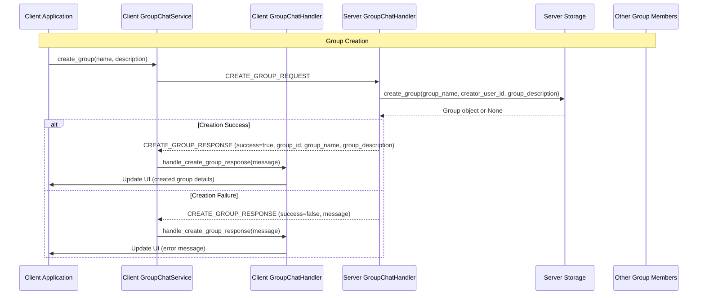
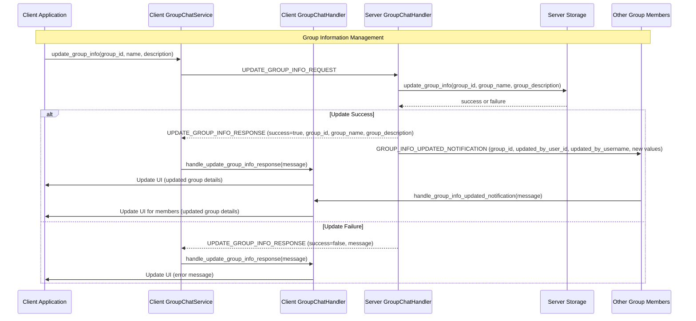
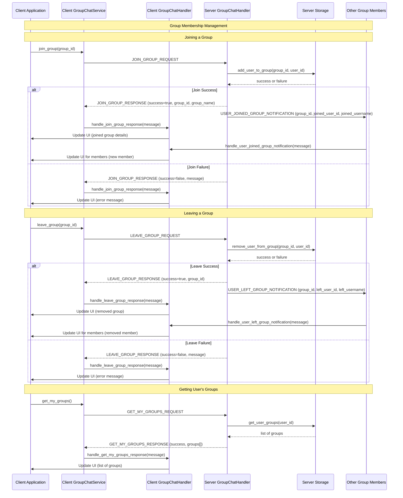
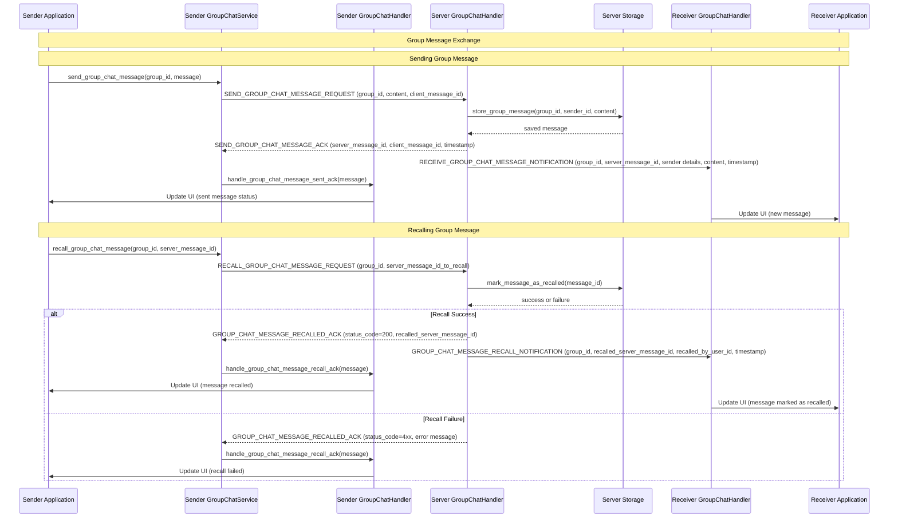

```mermaid
sequenceDiagram
    participant ClientApp as Client Application
    participant ClientService as Client GroupChatService
    participant ClientHandler as Client GroupChatHandler
    participant ServerHandler as Server GroupChatHandler
    participant ServerStorage as Server Storage
    participant GroupMembers as Other Group Members

    Note over ClientApp, GroupMembers: Group Creation
    ClientApp->>ClientService: create_group(name, description)
    ClientService->>ServerHandler: CREATE_GROUP_REQUEST
    ServerHandler->>ServerStorage: create_group(group_name, creator_user_id, group_description)
    ServerStorage-->>ServerHandler: Group object or None
    alt Creation Success
        ServerHandler-->>ClientService: CREATE_GROUP_RESPONSE (success=true, group_id, group_name, group_description)
        ClientService->>ClientHandler: handle_create_group_response(message)
        ClientHandler->>ClientApp: Update UI (created group details)
    else Creation Failure
        ServerHandler-->>ClientService: CREATE_GROUP_RESPONSE (success=false, message)
        ClientService->>ClientHandler: handle_create_group_response(message)
        ClientHandler->>ClientApp: Update UI (error message)
    end
```

```mermaid
sequenceDiagram
    participant ClientApp as Client Application
    participant ClientService as Client GroupChatService
    participant ClientHandler as Client GroupChatHandler
    participant ServerHandler as Server GroupChatHandler
    participant ServerStorage as Server Storage
    participant GroupMembers as Other Group Members

    Note over ClientApp, GroupMembers: Group Information Management
    ClientApp->>ClientService: update_group_info(group_id, name, description)
    ClientService->>ServerHandler: UPDATE_GROUP_INFO_REQUEST
    ServerHandler->>ServerStorage: update_group_info(group_id, group_name, group_description)
    ServerStorage-->>ServerHandler: success or failure
    alt Update Success
        ServerHandler-->>ClientService: UPDATE_GROUP_INFO_RESPONSE (success=true, group_id, group_name, group_description)
        ServerHandler->>GroupMembers: GROUP_INFO_UPDATED_NOTIFICATION (group_id, updated_by_user_id, updated_by_username, new values)
        ClientService->>ClientHandler: handle_update_group_info_response(message)
        ClientHandler->>ClientApp: Update UI (updated group details)
        GroupMembers->>ClientHandler: handle_group_info_updated_notification(message)
        ClientHandler->>ClientApp: Update UI for members (updated group details)
    else Update Failure
        ServerHandler-->>ClientService: UPDATE_GROUP_INFO_RESPONSE (success=false, message)
        ClientService->>ClientHandler: handle_update_group_info_response(message)
        ClientHandler->>ClientApp: Update UI (error message)
    end
```

```mermaid
sequenceDiagram
    participant ClientApp as Client Application
    participant ClientService as Client GroupChatService
    participant ClientHandler as Client GroupChatHandler
    participant ServerHandler as Server GroupChatHandler
    participant ServerStorage as Server Storage
    participant GroupMembers as Other Group Members

    Note over ClientApp, GroupMembers: Group Membership Management

    Note over ClientApp, GroupMembers: Joining a Group
    ClientApp->>ClientService: join_group(group_id)
    ClientService->>ServerHandler: JOIN_GROUP_REQUEST
    ServerHandler->>ServerStorage: add_user_to_group(group_id, user_id)
    ServerStorage-->>ServerHandler: success or failure
    alt Join Success
        ServerHandler-->>ClientService: JOIN_GROUP_RESPONSE (success=true, group_id, group_name)
        ServerHandler->>GroupMembers: USER_JOINED_GROUP_NOTIFICATION (group_id, joined_user_id, joined_username)
        ClientService->>ClientHandler: handle_join_group_response(message)
        ClientHandler->>ClientApp: Update UI (joined group details)
        GroupMembers->>ClientHandler: handle_user_joined_group_notification(message)
        ClientHandler->>ClientApp: Update UI for members (new member)
    else Join Failure
        ServerHandler-->>ClientService: JOIN_GROUP_RESPONSE (success=false, message)
        ClientService->>ClientHandler: handle_join_group_response(message)
        ClientHandler->>ClientApp: Update UI (error message)
    end

    Note over ClientApp, GroupMembers: Leaving a Group
    ClientApp->>ClientService: leave_group(group_id)
    ClientService->>ServerHandler: LEAVE_GROUP_REQUEST
    ServerHandler->>ServerStorage: remove_user_from_group(group_id, user_id)
    ServerStorage-->>ServerHandler: success or failure
    alt Leave Success
        ServerHandler-->>ClientService: LEAVE_GROUP_RESPONSE (success=true, group_id)
        ServerHandler->>GroupMembers: USER_LEFT_GROUP_NOTIFICATION (group_id, left_user_id, left_username)
        ClientService->>ClientHandler: handle_leave_group_response(message)
        ClientHandler->>ClientApp: Update UI (removed group)
        GroupMembers->>ClientHandler: handle_user_left_group_notification(message)
        ClientHandler->>ClientApp: Update UI for members (removed member)
    else Leave Failure
        ServerHandler-->>ClientService: LEAVE_GROUP_RESPONSE (success=false, message)
        ClientService->>ClientHandler: handle_leave_group_response(message)
        ClientHandler->>ClientApp: Update UI (error message)
    end

    Note over ClientApp, GroupMembers: Getting User's Groups
    ClientApp->>ClientService: get_my_groups()
    ClientService->>ServerHandler: GET_MY_GROUPS_REQUEST
    ServerHandler->>ServerStorage: get_user_groups(user_id)
    ServerStorage-->>ServerHandler: list of groups
    ServerHandler-->>ClientService: GET_MY_GROUPS_RESPONSE (success, groups[])
    ClientService->>ClientHandler: handle_get_my_groups_response(message)
    ClientHandler->>ClientApp: Update UI (list of groups)
```

```mermaid
sequenceDiagram
    participant SenderApp as Sender Application
    participant SenderService as Sender GroupChatService
    participant SenderHandler as Sender GroupChatHandler
    participant ServerHandler as Server GroupChatHandler
    participant ServerStorage as Server Storage
    participant ReceiverHandler as Receiver GroupChatHandler
    participant ReceiverApp as Receiver Application

    Note over SenderApp, ReceiverApp: Group Message Exchange

    Note over SenderApp, ReceiverApp: Sending Group Message
    SenderApp->>SenderService: send_group_chat_message(group_id, message)
    SenderService->>ServerHandler: SEND_GROUP_CHAT_MESSAGE_REQUEST (group_id, content, client_message_id)
    ServerHandler->>ServerStorage: store_group_message(group_id, sender_id, content)
    ServerStorage-->>ServerHandler: saved message
    ServerHandler-->>SenderService: SEND_GROUP_CHAT_MESSAGE_ACK (server_message_id, client_message_id, timestamp)
    ServerHandler->>ReceiverHandler: RECEIVE_GROUP_CHAT_MESSAGE_NOTIFICATION (group_id, server_message_id, sender details, content, timestamp)
    SenderService->>SenderHandler: handle_group_chat_message_sent_ack(message)
    SenderHandler->>SenderApp: Update UI (sent message status)
    ReceiverHandler->>ReceiverApp: Update UI (new message)

    Note over SenderApp, ReceiverApp: Recalling Group Message
    SenderApp->>SenderService: recall_group_chat_message(group_id, server_message_id)
    SenderService->>ServerHandler: RECALL_GROUP_CHAT_MESSAGE_REQUEST (group_id, server_message_id_to_recall)
    ServerHandler->>ServerStorage: mark_message_as_recalled(message_id)
    ServerStorage-->>ServerHandler: success or failure
    alt Recall Success
        ServerHandler-->>SenderService: GROUP_CHAT_MESSAGE_RECALLED_ACK (status_code=200, recalled_server_message_id)
        ServerHandler->>ReceiverHandler: GROUP_CHAT_MESSAGE_RECALL_NOTIFICATION (group_id, recalled_server_message_id, recalled_by_user_id, timestamp)
        SenderService->>SenderHandler: handle_group_chat_message_recall_ack(message)
        SenderHandler->>SenderApp: Update UI (message recalled)
        ReceiverHandler->>ReceiverApp: Update UI (message marked as recalled)
    else Recall Failure
        ServerHandler-->>SenderService: GROUP_CHAT_MESSAGE_RECALLED_ACK (status_code=4xx, error message)
        SenderService->>SenderHandler: handle_group_chat_message_recall_ack(message)
        SenderHandler->>SenderApp: Update UI (recall failed)
    end
```
