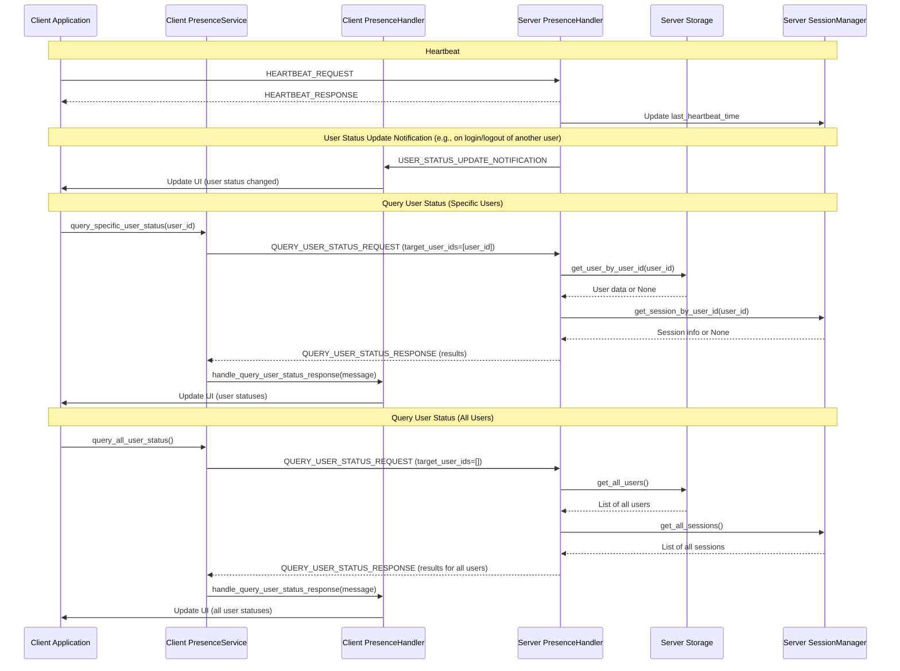

```mermaid
sequenceDiagram
    participant ClientApp as Client Application
    participant ClientService as Client PresenceService
    participant ClientHandler as Client PresenceHandler
    participant ServerHandler as Server PresenceHandler
    participant ServerStorage as Server Storage
    participant ServerSession as Server SessionManager

    Note over ClientApp, ServerSession: Heartbeat
    ClientApp->>ServerHandler: HEARTBEAT_REQUEST
    ServerHandler-->>ClientApp: HEARTBEAT_RESPONSE
    ServerHandler->>ServerSession: Update last_heartbeat_time

    Note over ClientApp, ServerSession: User Status Update Notification (e.g., on login/logout of another user)
    ServerHandler->>ClientHandler: USER_STATUS_UPDATE_NOTIFICATION
    ClientHandler->>ClientApp: Update UI (user status changed)

    Note over ClientApp, ServerSession: Query User Status (Specific Users)
    ClientApp->>ClientService: query_specific_user_status(user_id)
    ClientService->>ServerHandler: QUERY_USER_STATUS_REQUEST (target_user_ids=[user_id])
    ServerHandler->>ServerStorage: get_user_by_user_id(user_id)
    ServerStorage-->>ServerHandler: User data or None
    ServerHandler->>ServerSession: get_session_by_user_id(user_id)
    ServerSession-->>ServerHandler: Session info or None
    ServerHandler-->>ClientService: QUERY_USER_STATUS_RESPONSE (results)
    ClientService->>ClientHandler: handle_query_user_status_response(message)
    ClientHandler->>ClientApp: Update UI (user statuses)

    Note over ClientApp, ServerSession: Query User Status (All Users)
    ClientApp->>ClientService: query_all_user_status()
    ClientService->>ServerHandler: QUERY_USER_STATUS_REQUEST (target_user_ids=[])
    ServerHandler->>ServerStorage: get_all_users()
    ServerStorage-->>ServerHandler: List of all users
    ServerHandler->>ServerSession: get_all_sessions()
    ServerSession-->>ServerHandler: List of all sessions
    ServerHandler-->>ClientService: QUERY_USER_STATUS_RESPONSE (results for all users)
    ClientService->>ClientHandler: handle_query_user_status_response(message)
    ClientHandler->>ClientApp: Update UI (all user statuses)

```
