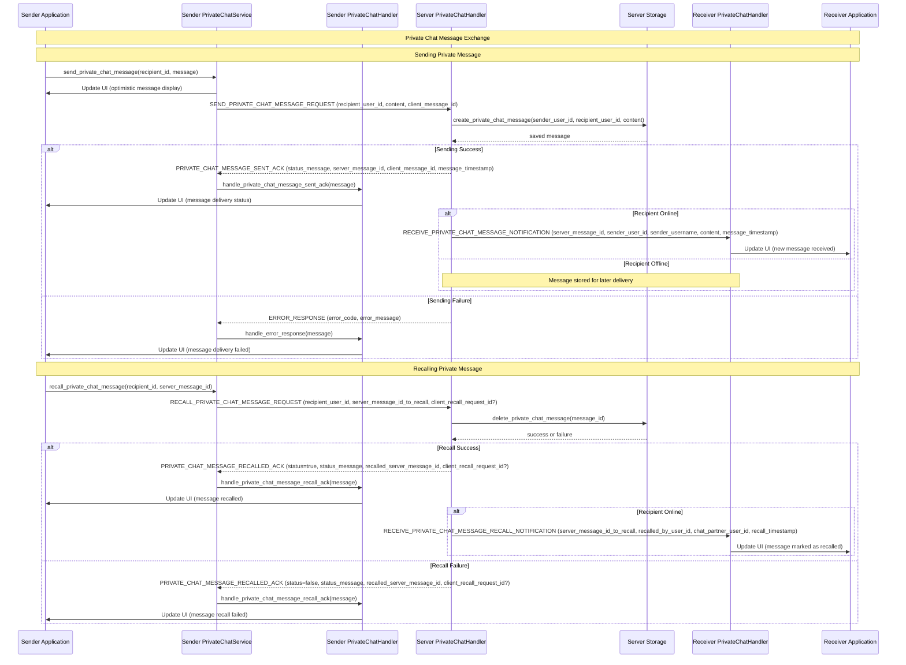

```mermaid
sequenceDiagram
    participant SenderApp as Sender Application
    participant SenderService as Sender PrivateChatService
    participant SenderHandler as Sender PrivateChatHandler
    participant ServerHandler as Server PrivateChatHandler
    participant ServerStorage as Server Storage
    participant ReceiverHandler as Receiver PrivateChatHandler
    participant ReceiverApp as Receiver Application

    Note over SenderApp, ReceiverApp: Private Chat Message Exchange

    Note over SenderApp, ReceiverApp: Sending Private Message
    SenderApp->>SenderService: send_private_chat_message(recipient_id, message)
    SenderService->>SenderApp: Update UI (optimistic message display)
    SenderService->>ServerHandler: SEND_PRIVATE_CHAT_MESSAGE_REQUEST (recipient_user_id, content, client_message_id)
    ServerHandler->>ServerStorage: create_private_chat_message(sender_user_id, recipient_user_id, content)
    ServerStorage-->>ServerHandler: saved message

    alt Sending Success
        ServerHandler-->>SenderService: PRIVATE_CHAT_MESSAGE_SENT_ACK (status_message, server_message_id, client_message_id, message_timestamp)
        SenderService->>SenderHandler: handle_private_chat_message_sent_ack(message)
        SenderHandler->>SenderApp: Update UI (message delivery status)

        alt Recipient Online
            ServerHandler->>ReceiverHandler: RECEIVE_PRIVATE_CHAT_MESSAGE_NOTIFICATION (server_message_id, sender_user_id, sender_username, content, message_timestamp)
            ReceiverHandler->>ReceiverApp: Update UI (new message received)
        else Recipient Offline
            Note over ServerHandler, ReceiverHandler: Message stored for later delivery
        end
    else Sending Failure
        ServerHandler-->>SenderService: ERROR_RESPONSE (error_code, error_message)
        SenderService->>SenderHandler: handle_error_response(message)
        SenderHandler->>SenderApp: Update UI (message delivery failed)
    end

    Note over SenderApp, ReceiverApp: Recalling Private Message
    SenderApp->>SenderService: recall_private_chat_message(recipient_id, server_message_id)
    SenderService->>ServerHandler: RECALL_PRIVATE_CHAT_MESSAGE_REQUEST (recipient_user_id, server_message_id_to_recall, client_recall_request_id?)
    ServerHandler->>ServerStorage: delete_private_chat_message(message_id)
    ServerStorage-->>ServerHandler: success or failure

    alt Recall Success
        ServerHandler-->>SenderService: PRIVATE_CHAT_MESSAGE_RECALLED_ACK (status=true, status_message, recalled_server_message_id, client_recall_request_id?)
        SenderService->>SenderHandler: handle_private_chat_message_recall_ack(message)
        SenderHandler->>SenderApp: Update UI (message recalled)

        alt Recipient Online
            ServerHandler->>ReceiverHandler: RECEIVE_PRIVATE_CHAT_MESSAGE_RECALL_NOTIFICATION (server_message_id_to_recall, recalled_by_user_id, chat_partner_user_id, recall_timestamp)
            ReceiverHandler->>ReceiverApp: Update UI (message marked as recalled)
        end
    else Recall Failure
        ServerHandler-->>SenderService: PRIVATE_CHAT_MESSAGE_RECALLED_ACK (status=false, status_message, recalled_server_message_id, client_recall_request_id?)
        SenderService->>SenderHandler: handle_private_chat_message_recall_ack(message)
        SenderHandler->>SenderApp: Update UI (message recall failed)
    end
```
